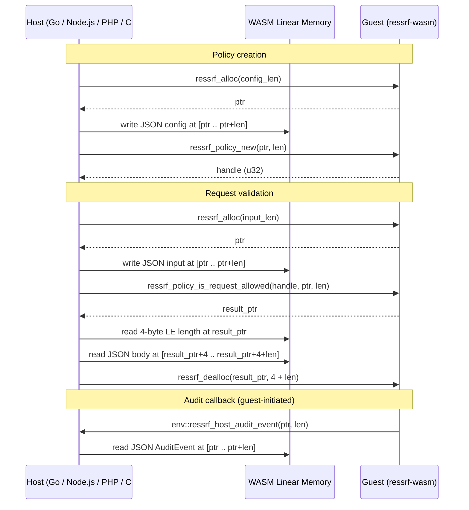

# Hacking on ressrf

This guide covers everything you need to develop, test, and extend ressrf. For a high-level overview of the project and its packages, see the [README](README.md).

## General development practices

- **Document internal APIs.** ressrf does not have a public Rust API (yet), but the internal APIs should be documented as if they might become public one day. Well-documented internals make life easier for new contributors.
- **Write unit tests.** Small changes in the CIDR engine or policy logic can percolate into security-relevant bugs. Help us catch these early by testing at the smallest unit of behavior.
- **Cross-language conformance.** Every feature must pass the same shared JSON test vectors in all supported languages. If you add a new policy behavior, add a vector and verify it passes in Rust, Go, Python, and Node.js.
- **Test on real inputs.** Before opening a PR, run your changes against non-sample inputs. For cloud modules, verify real metadata endpoint IPs. For URL validation, test with payloads from known SSRF bypass advisories.
- **Use conventional commits.** These are not mandatory, but they make it easier to quickly scan the contents of a change visually. Help us out by using them.

## Requirements

ressrf's Rust core only requires the Rust compiler. The full multi-language workspace needs a few more tools:

| Tool | Version | Needed for |
|------|---------|------------|
| Rust | 1.75+ (MSRV) | Workspace builds, tests, fuzzing |
| `wasm32-wasip1` target | via `rustup target add` | WASM module rebuild |
| `wasm-tools` | latest | Stripping debug sections from WASM binary |
| `wasm-opt` | latest (optional) | Size-optimizing WASM binary (`-Oz`) |
| Go | 1.26+ | Go package |
| Python | 3.10+ | Python bindings |
| `uv` | latest | Python environment management |
| `maturin` | latest | Building the PyO3 native extension |
| Node.js | 20+ | Node.js package |
| `cargo-fuzz` | latest | Fuzzing (`cargo install cargo-fuzz`) |

Install the Rust toolchain from [rustup.rs](https://rustup.rs/). Install `uv` from [docs.astral.sh/uv](https://docs.astral.sh/uv/).

## Building locally

### Rust workspace

```bash
cargo build --workspace --all-features
```

### WASM module

The WASM binary (`core.wasm`) is consumed by Go and Node.js. It is checked into the repo and updated by CI, but you can rebuild it locally:

```bash
rustup target add wasm32-wasip1
cargo install wasm-tools
bash go/ressrf/build_wasm.sh
```

The script compiles `ressrf-wasm` for `wasm32-wasip1`, runs `wasm-opt -Oz` if available, and strips debug sections. The resulting binary is written to `go/ressrf/core.wasm`. CI copies it to `node/core.wasm` as well.

### Go

```bash
cd go/ressrf && go build ./...
```

### Python

```bash
cd python
uv sync
maturin develop
```

### Node.js

```bash
cd node
npm ci
```

## Formatting and linting

CI enforces formatting and linting in all languages. Run them locally before pushing to avoid unnecessary review cycles:

```bash
# Rust
cargo fmt --all
cargo clippy --workspace --all-targets --all-features -- -D warnings

# Go
cd go/ressrf && golangci-lint run ./...

# Python
cd python
uv run ruff check .
uv run ruff format .
uv run ty check

# Node.js
cd node && npx tsc --noEmit
```

## Testing

### Running tests

```bash
# Rust (all crates, all features)
cargo test --workspace --all-features

# Go (with race detector)
cd go/ressrf && go test -race ./...

# Python
cd python && uv run pytest tests/ -v

# Node.js
cd node && node --import tsx --test tests/*.test.ts
```

### Shared test vectors

All languages load shared test vectors from `tests/vectors/` to guarantee identical behavior:

| File | Coverage |
|------|----------|
| `cidr_containment.json` | CIDR parsing, bitwise containment, v4/v6 edge cases |
| `ipv4_ipv6_mapping.json` | IPv4-mapped IPv6 normalization |
| `policy_decisions.json` | Policy presets, allow/deny, cloud providers |
| `url_validation.json` | URI structure, scheme allowlist, domain matching |
| `url_rules.json` | Host/path glob, regex deny, `bypass_ip_check` |
| `ssrf_techniques.json` | SSRF bypass technique taxonomy: IP representation tricks (decimal/octal/hex/shorthand), IPv6 variants (mapped, 6to4, Teredo, NAT64, AWS IMDSv6), URL parser confusion (userinfo, NUL/CRLF, backslash, UNC, trailing dot, scheme-less), protocol smuggling, cloud metadata, Unicode/IDN |
| `redirect_chains.json` | Multi-hop redirect re-validation |
| `audit_events.json` | Audit event serialization and field structure |

Each file contains an array of test cases with `description`, input fields, and `expected` outcome. When adding a new vector, verify it passes in all four languages before opening a PR.

### Tier 2 e2e tests (Docker required)

`crates/ressrf-tcp/tests/ssrf_e2e.rs` exercises bypass techniques through the full network stack: `SafeConnector` -> `SafeResolver` -> `Policy`, with a hickory-based DNS backend pointed at a CoreDNS testcontainer plus a WireMock testcontainer for redirect chains. It is gated behind the `e2e` Cargo feature so the regular workspace test matrix stays hermetic on macOS / Windows.

```bash
cargo test --features e2e -p ressrf-tcp --test ssrf_e2e
```

The container assets (CoreDNS Corefile + zone, WireMock stub mappings) live under `tests/containers/` and are documented in `tests/containers/README.md`. Tests guard themselves with the `skip_without_docker!` macro and pass with a printed skip notice on machines without a Linux-capable Docker daemon. CI runs the full matrix on Ubuntu via the dedicated `e2e-tests` job in `.github/workflows/ci.yml`.

## Fuzzing

ressrf uses `cargo-fuzz` (libfuzzer) with three targets:

```bash
# Run a specific target
cargo fuzz run fuzz_cidr -- -max_len=4096
cargo fuzz run fuzz_policy -- -max_len=4096
cargo fuzz run fuzz_url_validator -- -max_len=8192
```

Fuzz targets live in `fuzz/fuzz_targets/` and use the `arbitrary` crate for structured input generation. Corpus directories are under `fuzz/corpus/<target>/`. CI runs weekly on nightly with crash artifacts uploaded.

### Adding a new fuzz target

1. Create `fuzz/fuzz_targets/fuzz_<name>.rs`
2. Define a struct deriving `Arbitrary` for structured input
3. Use `fuzz_target!` to exercise the code under test
4. Register the binary in `fuzz/Cargo.toml`:

```toml
[[bin]]
name = "fuzz_<name>"
path = "fuzz_targets/fuzz_<name>.rs"
doc = false
```

See `fuzz/fuzz_targets/fuzz_policy.rs` for a complete example that builds a `PolicyBuilder` with arbitrary presets, CIDRs, and IPs, then asserts structural invariants.

## Benchmarking

### Rust

Criterion benchmarks live in `crates/ressrf-core/benches/core_bench.rs`:

```bash
cargo bench -p ressrf-core
```

### Go

```bash
cd go/ressrf && go test -bench=. -benchmem
```

Results are documented in [benchmark.md](benchmark.md).

## Adding a new cloud provider

ressrf's cloud modules follow a codegen pattern: JSON config is read at build time and compiled into static Rust constants. Adding a new provider (e.g. DigitalOcean, Oracle Cloud) requires changes across several layers.

### Step 1: Create the JSON config

Create `crates/ressrf-core/config/domains_<provider>.json` following the same schema as the existing providers:

```json
{
  "provider": "<provider>",
  "last_updated": "2026-01-01",
  "deny_ranges": [
    { "cidr": "169.254.169.254/32", "name": "Metadata endpoint" }
  ],
  "denied_domain_suffixes": [
    ".internal.example.com"
  ],
  "service_domain_suffixes": [
    ".example-cloud.com"
  ],
  "service_ranges": {}
}
```

### Step 2: Register in build.rs

In `crates/ressrf-core/build.rs`, add the provider name to the `providers` array in `generate_cloud_domains()`:

```rust
let providers = ["aws", "azure", "gcp", "<provider>"];
```

This causes `build.rs` to generate `cloud_<provider>_generated.rs` with `DENY_RANGES`, `DENIED_DOMAIN_SUFFIXES`, and `SERVICE_DOMAIN_SUFFIXES` constants.

### Step 3: Create the cloud module

Create `crates/ressrf-core/src/cloud/<provider>.rs`:

```rust
//! <Provider> cloud module: metadata deny ranges and internal domain suffixes.
//!
//! Constants are generated at build time from `config/domains_<provider>.json` via `build.rs`.

include!(concat!(env!("OUT_DIR"), "/cloud_<provider>_generated.rs"));
```

### Step 4: Wire into cloud/mod.rs

In `crates/ressrf-core/src/cloud/mod.rs`:

1. Add `pub mod <provider>;`
2. Add a variant to the `CloudProvider` enum
3. Extend all four `match` arms: `deny_ranges`, `denied_domain_suffixes`, `service_domain_suffixes`, `name`

### Step 5: Wire through WASM

In `crates/ressrf-wasm/src/lib.rs`, add a match arm in the `cloud_providers` loop inside `ressrf_policy_new`:

```rust
"<provider>" => {
    builder.with_cloud(CloudProvider::<Provider>);
}
```

### Step 6: Wire through language bindings

- **Go** (`go/ressrf/policy.go`): the cloud string is passed through JSON to WASM, so Go needs no code change unless you want to add validation or constants.
- **Python** (`python/src/lib.rs`): add a match arm in `CorePolicyBuilder::with_cloud` for the new provider string.
- **Node.js** (`node/src/policy.ts`): cloud strings pass through JSON to WASM, so Node.js needs no code change unless you want to add validation or type narrowing.

### Step 7: Add test vectors

Add cloud-specific test cases to `tests/vectors/policy_decisions.json` and verify all four languages pass.

### Step 8: Update codegen script (if applicable)

If the provider publishes machine-readable IP ranges, update `scripts/generate_ip_ranges.py` to fetch and merge them.

### Step 9: Update documentation

Update the root README, `crates/ressrf-core/README.md`, and any language-specific READMEs that list supported providers.

## Adding a new programming language binding

There are two integration paths:

### WASM-based bindings (Go, Node.js, PHP, C#, Java)

WASM-based bindings consume the prebuilt `core.wasm` through a language-specific WASM runtime. They all follow the same pattern:

1. **Load the WASM module** with WASI preview 1 support (most runtimes provide this out of the box)
2. **Export a host function** `env::ressrf_host_audit_event(ptr, len)` that the guest calls to emit audit events
3. **Resolve guest exports**: `ressrf_alloc`, `ressrf_dealloc`, `ressrf_policy_new`, `ressrf_policy_free`, `ressrf_policy_is_network_allowed`, `ressrf_policy_is_request_allowed`, `ressrf_uri_in_domain`, `ressrf_policy_set_audit_callback`
4. **Communicate via JSON over linear memory**: allocate guest memory, write JSON input, call the guest function, read the length-prefixed JSON result, free the allocation

The WASM ABI is documented in [crates/ressrf-wasm/README.md](crates/ressrf-wasm/README.md). A forward-looking WIT definition is at [crates/ressrf-wasm/wit/ressrf.wit](crates/ressrf-wasm/wit/ressrf.wit).

**Reference implementations:**
- Go: [go/ressrf/wasm.go](go/ressrf/wasm.go) (wazero, `//go:embed core.wasm`)
- Node.js: [node/src/wasm.ts](node/src/wasm.ts) (Node.js WebAssembly API with WASI stubs)

### Native bindings (Python via PyO3)

Native bindings link `ressrf-core` directly, avoiding the WASM layer. This gives full access to Rust types but requires a per-platform build step.

**Reference implementation:** [python/src/lib.rs](python/src/lib.rs) (PyO3/maturin)

### Checklist for any new binding

Regardless of the integration path, every new language binding must provide:

1. **Directory**: `<lang>/` at the repo root (e.g. `php/`, `dotnet/`, `java/`)
2. **Policy API**: `PolicyBuilder` (fluent) and `Policy` (immutable, thread-safe after build), with presets (`external_only`, `internal_only`, `none`), cloud providers, allow/deny CIDRs, and URL rules
3. **Error type**: `RessrfBlockedError` (or language-idiomatic equivalent) with a structured `.reason` field
4. **Audit**: `AuditSink` interface, `AuditFunc` callback adapter, `MultiSink`, `DiscardSink`. The library never dictates which logging framework to use.
5. **Protocol adapters**: TCP (DNS-validated connect), HTTP (redirect re-validation per hop), SSH (guard). These can be optional dependencies.
6. **Conformance tests**: load all files from `tests/vectors/*.json` and run every shared vector
7. **CI job**: add `test-<lang>` and `lint-<lang>` jobs to `.github/workflows/ci.yml` with a multi-OS matrix
8. **README**: per-package README with API examples and installation instructions
9. **Root README**: add to the packages table and installation table

## Adding a new protocol adapter

Protocol adapters sit above `ressrf-tcp` and validate network destinations against the policy before connecting. The general pattern is: resolve host, validate all resolved IPs against `Policy`, then connect only to validated addresses.

### Step-by-step (Rust crate)

1. Create `crates/ressrf-<protocol>/` with a `Cargo.toml` depending on `ressrf-core` and `ressrf-tcp`
2. Add the crate to the workspace `members` array in the root `Cargo.toml`
3. Implement validation at DNS resolution and/or connection establishment
4. Expose a guard type (e.g. `SafeGrpcConnector`) that wraps the protocol client and delegates IP validation to `SafeResolver`/`SafeConnector`
5. Add unit tests and a per-crate README

The key architectural constraint: validation must happen at the IP level after DNS resolution, not at the URL or hostname level. This eliminates DNS rebinding attacks.

**Reference implementations:**
- [crates/ressrf-tcp/](crates/ressrf-tcp/) for the DNS resolver and connector pattern
- [crates/ressrf-http/](crates/ressrf-http/) for Tower Layer/Service with redirect re-validation
- [crates/ressrf-ssh/](crates/ressrf-ssh/) for a simpler guard wrapper

### Mirroring in language bindings

After adding a Rust protocol crate, mirror the adapter in each language binding:

- **Go**: add `protocol_<name>.go` using `SafeDialer`/`SafeDialContext` from `protocol_tcp.go`
- **Python**: add a module under `python/ressrf/protocols/` hooking into the client library's DNS or socket layer
- **Node.js**: add `node/src/protocols/<name>.ts` using the `dnsLookup` override or `createConnection` from `protocols/tcp.ts`

## Adding a new client library integration

For language-specific HTTP client integrations (e.g. a Python adapter for `aiohttp`, or a Node.js adapter for `got`):

1. **Integrate at the DNS/connect layer**, not at the HTTP-response layer. The policy must be evaluated before bytes leave the machine.
2. **Hook into the client's resolver or socket-creation callback.** Most HTTP clients expose one of these.
3. **Validate all resolved IPs** against the policy before any connection is established.
4. **Re-validate on every redirect hop.** A redirect from a public host to `169.254.169.254` must be caught.
5. **Return `RessrfBlockedError`** (or the language-idiomatic equivalent) on policy rejection. Never silently drop the connection.

**Existing integrations to reference:**

| Language | Client | Hook point |
|----------|--------|------------|
| Rust | Tower-compatible (hyper, axum) | `tower::Layer` / `tower::Service` |
| Go | `net/http` | `http.Transport.DialContext` via `SafeDialContext` |
| Python | httpx | `SafeTransport` / `AsyncSafeTransport` |
| Python | requests | `SafeAdapter` (mounted on `HTTPAdapter`) |
| Node.js | `node:http` / `node:https` | `http.Agent` with `dnsLookup` override |
| Node.js | undici | `undiciConnect` for custom Agent |

## Working with the WASM ABI

The WASM ABI is a thin C-style FFI over `ressrf-core`. All data passes as JSON strings through linear memory.

### Memory protocol



### Result encoding

The first 4 bytes at the result pointer encode the JSON body length as a little-endian `u32`. The host reads those 4 bytes, then reads `length` more bytes of JSON, then frees the entire allocation (`4 + length` bytes) with `ressrf_dealloc`.

### Audit callback

When audit is enabled via `ressrf_policy_set_audit_callback(1)`, the guest calls the host-imported function `env::ressrf_host_audit_event(ptr, len)` with a JSON-encoded `AuditEvent`. The host reads the bytes and frees nothing (the guest manages this memory).

### WASI requirements

The module requires `wasi_snapshot_preview1`. Most functions can be stubbed (return 0). See `node/src/wasm.ts` `createWasiStub()` for the minimal set. Go's wazero provides a full WASI implementation via `wasi_snapshot_preview1.MustInstantiate`.

### PolicyConfig JSON schema

```json
{
  "preset": "external_only",
  "allow_cidrs": ["10.42.0.0/16"],
  "deny_cidrs": [],
  "cloud_providers": ["aws", "azure", "gcp"],
  "url_rules": null
}
```

Valid presets: `"external_only"`, `"internal_only"`, `"none"`.

## Working with test vectors

### Structure

Each vector file in `tests/vectors/` is a JSON array of test case objects. Every case has a `description` field and an `expected` outcome. Input fields vary by file.

### Adding a new test case

1. Add the case to the appropriate JSON file
2. Run all four language test suites to verify the new case passes
3. If any language fails, the test vector has exposed a cross-language divergence that must be fixed

### Adding a new vector file

1. Create `tests/vectors/<name>.json` with the array-of-cases structure
2. Add a Rust integration test in `crates/ressrf-core/tests/` that loads and runs the vectors
3. Add a Go test in `go/ressrf/` that loads the same file
4. Add a Python test in `python/tests/` (use the existing `conftest.py` fixture pattern for vector loading)
5. Add a Node.js test in `node/tests/` following the existing `*.test.ts` pattern

### Path resolution

Test loaders walk up from their manifest/package directory to find the repo root `tests/vectors/` directory. See `crates/ressrf-core/tests/test_vectors.rs` for the Rust approach and `python/tests/conftest.py` for the Python fixture.

## IP ranges codegen

`scripts/generate_ip_ranges.py` fetches upstream IP range data from IANA special-purpose registries, AWS, Azure, and GCP. It is stdlib-only Python (no pip dependencies).

```bash
python scripts/generate_ip_ranges.py              # full update from all upstream sources
python scripts/generate_ip_ranges.py --iana-only   # only fetch IANA CSVs
python scripts/generate_ip_ranges.py --validate-only  # validate existing JSON, no network
python scripts/generate_ip_ranges.py --dry-run     # print changes without writing
```

Outputs go to `crates/ressrf-core/config/`:
- `ip_ranges.json` (IANA deny tiers)
- `domains_aws.json`, `domains_azure.json`, `domains_gcp.json` (cloud deny ranges, domains, service ranges)

A monthly CI workflow (`.github/workflows/update-ip-ranges.yml`) runs the script, validates the output with `--validate-only`, runs `cargo test`, and opens a PR if anything changed.

## CI/CD conventions

- **Action pinning**: all GitHub Actions are pinned by full commit SHA with a version comment (e.g. `@abc123 # v4.1.0`). Never pin by tag alone.
- **Permissions**: top-level `permissions: {}` with least-privilege per-job overrides. Every permission line has an explanatory comment.
- **Checkout**: `persist-credentials: false` on all checkout steps.
- **Multi-OS matrix**: ubuntu-latest, macos-latest, windows-latest for all language test jobs.
- **Rust flags**: `RUSTFLAGS=-Dwarnings` is set globally in CI.
- **Workflow security**: `zizmor --pedantic` must pass with zero findings on all GitHub Actions workflows.
- **Concurrency**: concurrency groups prevent duplicate runs on the same branch.
- **Dependency auditing**: `cargo audit` and `govulncheck` run on dependency changes and on a daily schedule.

## License

MIT
